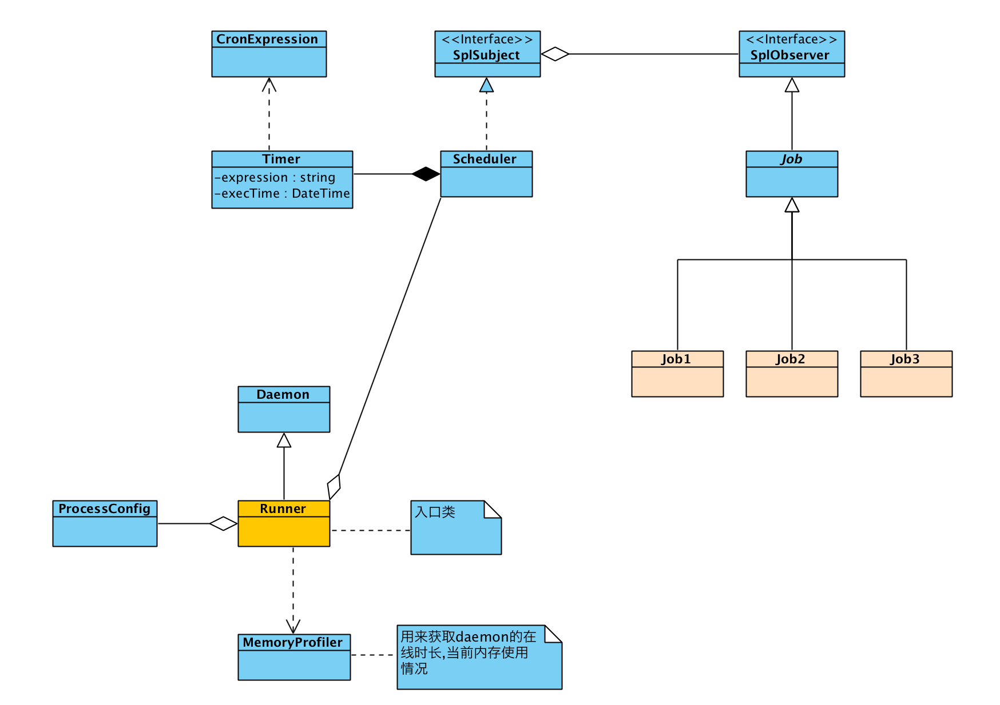

### 项目结构图


### 使用例子
```php
<?php

include 'vendor/autoload.php';

use Tony\Task\Job\Job;
use Tony\Task\Runner;
use Tony\Task\Scheduler;
use Tony\Task\Struct\ProcessConfig;

class Demo extends Job
{
    public function update(SplSubject $subject): void
    {
        /**@var Scheduler $subject */
        $expression = $subject->getTimer()->getExpression();
        error_log(date('Y-m-d H:i:s') . "\t{$expression}\n", 3, '/tmp/php-task.log');
    }
}

$processConfig          = new ProcessConfig();
$processConfig->pidFile = '/tmp/php-task.pid';
$processConfig->stdErr  = '/dev/null';
$processConfig->stdOut  = '/dev/null';
$processConfig->stdIn   = '/dev/null';

$schedule = new Scheduler();
$schedule->getTimer()->everyMinute();
$schedule->attach(new Demo());

$schedule5 = new Scheduler();
$schedule5->getTimer()->everyFiveMinutes();
$schedule5->attach(new Demo());

$schedule30 = new Scheduler();
$schedule30->getTimer()->everyThirtyMinutes();
$schedule30->attach(new Demo());


$schedules = new SplObjectStorage();
$schedules->attach($schedule);
$schedules->attach($schedule5);
$schedules->attach($schedule30);

$runner = new Runner();
$runner->setProcessConfig($processConfig);
$runner->setSchedulers($schedules);

$runner->run();
```

### 文件日志结果(/tmp/php-task.log)
```php
2018-06-17 15:06:05	*/1 * * * *
2018-06-17 15:07:00	*/1 * * * *
2018-06-17 15:08:00	*/1 * * * *
2018-06-17 15:09:00	*/1 * * * *
2018-06-17 15:10:00	*/1 * * * *
2018-06-17 15:10:00	*/5 * * * *
2018-06-17 15:11:00	*/1 * * * *
2018-06-17 15:12:00	*/1 * * * *
2018-06-17 15:13:00	*/1 * * * *
2018-06-17 15:14:00	*/1 * * * *
2018-06-17 15:15:00	*/1 * * * *
2018-06-17 15:15:00	*/5 * * * *
2018-06-17 15:16:00	*/1 * * * *
2018-06-17 15:17:00	*/1 * * * *
2018-06-17 15:18:00	*/1 * * * *
2018-06-17 15:19:00	*/1 * * * *
2018-06-17 15:27:38	*/1 * * * *
2018-06-17 15:28:00	*/1 * * * *
2018-06-17 15:29:00	*/1 * * * *
2018-06-17 15:30:00	*/1 * * * *
2018-06-17 15:30:00	*/5 * * * *
2018-06-17 15:30:00	*/30 * * * *
2018-06-17 15:31:00	*/1 * * * *
2018-06-17 15:32:00	*/1 * * * *
```

### 特性
- 自动识别时区,不同时区的服务器再也不用手动修改时区

### 表达式说明
```php
*    *    *    *    *
-    -    -    -    -
|    |    |    |    |
|    |    |    |    |
|    |    |    |    +----- day of week (0 - 7) (Sunday=0 or 7)
|    |    |    +---------- month (1 - 12)
|    |    +--------------- day of month (1 - 31)
|    +-------------------- hour (0 - 23)
+------------------------- min (0 - 59)
```

#### 参考文章
https://segmentfault.com/a/1190000005979154
http://hejunhao.me/archives/470
